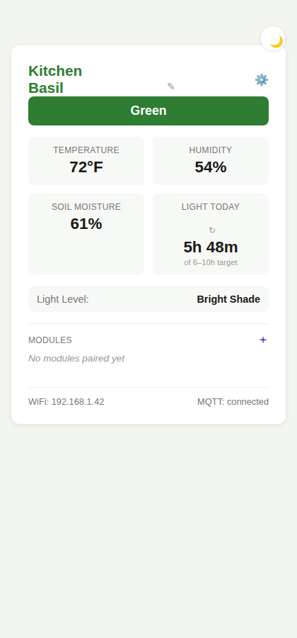

# 🌱 Green Thumb

A self-contained, expandable indoor plant growth helper built around an ESP32-C3, with full Home Assistant integration and a standalone web portal for everyone else.

Green Thumb monitors temperature, humidity, soil moisture, and light — cycles the data on a small OLED display, reflects overall plant health through an RGB status LED, and reports everything to Home Assistant over MQTT via a custom HACS integration. No HA? A lightweight web portal served directly from the device covers the same ground.

The base station is intentionally minimal — sensors and reporting only. Actuation (watering, grow lighting, and more) is handled by separate, purpose-built modules that pair to the base wirelessly over Bluetooth Low Energy, so the system grows without the base board ever needing a redesign.



*The web dashboard — live readings, health status, and light tracking, all served directly from the device.*

## Open source & community

Green Thumb is fully open source and built for the hacker/maker community. The full base station firmware, MQTT/BLE architecture, and (eventually) the HACS integration and module firmware are all published here — clone it, modify it, build your own modules, adapt it to hardware you already have on hand.

**Licensing note:** this project is released under CC BY-NC-SA 4.0 — free to use, modify, and share for noncommercial purposes with attribution. Commercial use (including selling assembled boards, kits, or modules built from this design) is reserved to the project maintainer. See [`LICENSE.md`](LICENSE.md).

**Fully assembled modules are planned for sale** directly from the maintainer once the base station and first BLE modules (starting with watering) are stable — for people who want the hardware without soldering it themselves. The design stays open regardless; buying an assembled unit is a convenience, not a requirement.

Contributions, issues, and forks are welcome. If you build a module, open a PR — the BLE GATT schema is designed specifically so third-party modules can be added without changing base firmware.

## Why

Most plant monitors either dump raw numbers with no interpretation, or lock you into a single cloud app. Green Thumb is local-first: your data lives in your Home Assistant instance (or on the device itself), thresholds are yours to configure per plant, and the hardware is designed to expand — a pump module, a grow light module, an NPK sensor — without replacing what you already built.

## Hardware (base station)

| Component | Purpose |
|---|---|
| ESP32-C3 Super Mini | Main controller — WiFi/MQTT gateway, BLE central |
| DHT11 | Temperature & humidity |
| Capacitive soil moisture sensor v1.2 | Soil moisture (calibrated per-sensor) |
| Photoresistor (LDR) | Light level — planned upgrade path to BH1750 digital lux sensor |
| SSD1306 128×64 OLED | Cycles through live sensor readings |
| WS2812 addressable RGB LED | Plant health at a glance (green / yellow / red), BLE pairing indicator |
| Pushbutton | Short press: cycle display · Long press: enter BLE pairing mode |

Units throughout: °F internally (thresholds, calibration, MQTT) and foot-candles. The OLED and dashboard can optionally display the live temperature reading in °C instead — a display-only preference, see `docs/ARCHITECTURE.md`.

Wiring diagram and pin assignments: [`docs/BUILD.md`](docs/BUILD.md#hardware).

## How it fits together

```
┌─────────────────────┐         MQTT / WiFi         ┌──────────────────┐
│   Green Thumb Base   │ ───────────────────────────▶│  Home Assistant   │
│  (sensors, display,  │                              │  (Mosquitto +     │
│   status LED, gateway)│                              │   custom HACS     │
│                      │◀──── BLE (central) ─────┐    │   integration)    │
└─────────────────────┘                          │    └──────────────────┘
                                                   │
                              ┌────────────────────┴───────────────────┐
                              │        Future BLE peripheral modules     │
                              │   watering pump · grow light · NPK sensor │
                              └───────────────────────────────────────────┘
```

Modules never touch WiFi or Home Assistant directly — the base is the only gateway. This keeps the network surface small and means a module can be designed, built, and paired without ever modifying base firmware.

## Status: base firmware complete, HACS integration and first module next

All core design decisions — MQTT topic structure, health-threshold logic, calibration flows, BLE pairing and GATT schema — are finalized, every planned driver and `/core/` module is built and tested, `main.py`/`boot.py` wire everything together into a running device, and the full web portal (setup, dashboard, settings, calibration, pairing) is complete. What's left: the HACS integration, verifying the confirmed GPIO pin map by actually wiring and powering a physical board, and the first BLE peripheral module (watering pump, deferred until the base is fully finalized). Full technical detail: [`docs/ARCHITECTURE.md`](docs/ARCHITECTURE.md). Build/flash/setup instructions, including a wiring diagram: [`docs/BUILD.md`](docs/BUILD.md).

### Done
- [x] Full architecture spec (MQTT topics, timing, thresholds, calibration & pairing state machines, BLE GATT schema)
- [x] `core/storage.py` — atomic flash read/write
- [x] `core/config.py` — config schema, defaults, load/save with forward-compatible merging
- [x] `drivers/dht11.py` — temperature/humidity
- [x] `drivers/soil_moisture.py` — soil moisture with two-point calibration
- [x] `drivers/light_sensor.py` — LDR light level (placeholder calibration pending a lux reference)
- [x] `drivers/display.py` — OLED screen cycling + night mode
- [x] `drivers/status_led.py` — WS2812 health colors + pairing indicator + boot animation
- [x] `drivers/button.py` — short/long press handling
- [x] `core/wifi.py`, `core/identity.py` — connectivity & base_id derivation
- [x] `core/ntp.py` — time sync
- [x] `core/mqtt_client.py` — topic builder, pub/sub wrapper, LWT
- [x] `core/health.py` — green/yellow/red calculation
- [x] `core/light_tracker.py` — daily light-hours accumulator
- [x] `core/calibration.py` — soil/light calibration state machine
- [x] `core/pairing.py` — pairing state machine
- [x] `core/ble_central.py` — scan/connect/GATT primitives (see caveats in docs/ARCHITECTURE.md)
- [x] `core/module_manager.py` — registry + BLE↔MQTT relay for paired modules
- [x] `web/` — full surface complete: WiFi setup, dashboard, settings, calibration, pairing
- [x] `tools/build_mpy.sh` — precompiles source to .mpy bytecode
- [x] `docs/BUILD.md` — build/flash/setup instructions (kept current with each new user-facing step)
- [x] `main.py` / `boot.py` — asyncio task orchestration, wiring everything above together (`boot.py` also sets up `sys.path` for cross-directory imports — a real bug where this was silently missing was caught and fixed, see `docs/ARCHITECTURE.md`)
- [x] `version.py` — firmware semver, published to MQTT/HA as `device_info` (gives the future HACS integration a `sw_version`)
- [x] Alert light + sensor failure tracking — generic `status_led.set_alert()` (never overrides night-mode DND), configurable per-sensor failure thresholds with dismiss support, "combined" or "layered" behavior for simultaneous failures
- [x] LED idle modes (solid/breathe/pulse-once/off) and colorblind-safe/custom color schemes — independently configurable for the web portal and the alert LED, with an optional sync
- [x] GPIO pin map (`pins.py`) — confirmed against a physical board photo (ACEIRMC ESP32-C3 Super Mini)

### Remaining

- [ ] Custom HACS integration (separate repo/component) - see [The-Green-Thumb-HACS-Integration](https://github.com/HackThePlanetKC/The-Green-Thumb-HACS-Integration), early scaffold
- [ ] HACS integration: track time spent at each configured light level (e.g. "3h in Direct Sun today") over the day - the base device only shows the *current* closest-matching light level (see the dashboard's Light Level badge), deliberately not per-category duration; HA has far more room for that kind of historical/statistical tracking than this device does.
- [ ] First BLE peripheral module: watering pump — **deferred until after the base device is finalized.** The base's module integration points (BLE GATT schema, `ble_central.py`, `module_manager.py`, `pairing.py`, display module screens, dashboard Modules section, MQTT `module/<mod_id>/*` topics) stay stable and working in the meantime, since modules will connect through them once this resumes.
- [ ] Light sensor real-world calibration (needs a lux reference)
- [ ] High-intensity/sunburn light thresholds (`light_fc.red_min`/`red_max`) — no sourced data yet

## Dashboard

The standalone web dashboard (served directly from the device, no Home Assistant required) shows live health status and sensor readings, and a few things worth calling out:

- **Editable device name** — rename your plant/device right from the dashboard, no separate settings page needed.
- **Reserved space for modules** — once a BLE module (watering pump, grow light, etc.) is paired, it shows up here automatically, with a "Calibrate" link that flags itself (⚠) if the module reports needing calibration.
- **"Light Today"** shows cumulative light exposure for the day (e.g. "13h 15m") against your target range, instead of a raw instantaneous reading. It's static on load with a manual refresh button, and the same on-demand refresh is available to Home Assistant via MQTT — so you're not stuck waiting on a periodic publish cycle to get a current number.
- **"Light Level"** (optional) — instead of a raw foot-candle number, you can sample named reference points (e.g. "Direct Sun," "Bright Shade," "Low Light" — name them however makes sense for your plant setup) and the dashboard shows whichever one the current reading is closest to. Off by default; enable it under Settings → advanced.
- **Dark mode**, following your system preference by default, with a manual toggle that's remembered on that browser.
- **Module calibration is a passthrough** — the base doesn't know or care what any given module type needs calibrated. Each module reports its own requirements (or none), and the calibration page renders whatever it asks for; the base just relays values back to it.

## Future module development

Modules are open-ended and not designed yet (the first, a watering pump, is deferred until the base is fully finalized), but the base's side of the contract is already built: modules report themselves over BLE, the base relays everything through to MQTT/HA/dashboard as a pure passthrough — it never interprets or hardcodes knowledge of any specific module type. Whatever you build just needs to report:

| Field | Type | Notes |
|---|---|---|
| **Name** | string | The module's own display name (e.g. "Tomato Pump"). Module-reported by default, but user-editable during pairing/setup (see below) — falls back to a formatted version of Type if never set either way. |
| **Type** | string | A generic category — `light`, `water`, `soil`, `misc`, etc. Examples, not a fixed enum; add new categories as needed. |
| **Short description** | string | A one-line summary of what the module does. |
| **Config required?** | bool | Whether this module needs user configuration before it's usable. |
| **Config options** | list, if required | What to configure — key/label/type per option, rendered as a generic form on the calibration page if the module doesn't supply anything richer. |
| **N data sources** | list | What data streams the module provides — key/label/unit per source. |

Each paired module stays associated with the specific base it's connected to — MQTT topics are already namespaced per-base (`greenthumb/<base_id>/module/<mod_id>/...`), so nothing extra is needed to keep, say, Base 1's pump from mixing with Base 2's pump.

**Handle the `set_name` action — Name is user-editable during setup, and auto-disambiguated on collision.** The pairing page lets the user optionally set a custom Name for a module right after it pairs. Separately, if two modules of the same type end up reporting the same default Name (two "Water Pump"s, say), the base automatically disambiguates on first connect by appending a number to whichever one connected second — `"Water Pump"` stays as-is, the next one becomes `"Water Pump 2"`, then `"Water Pump 3"`, and so on. Both cases push the result to the module the same way: `{"action": "set_name", "value": "..."}` over the same Command channel calibration values already use. Your module just needs one handler for this action, and should report back whatever name it adopted via its next State update — that's the only way the base knows the push was accepted.

See [`docs/ARCHITECTURE.md`](docs/ARCHITECTURE.md) for the full technical contract (exact JSON shape, the multi-base-station design notes, and what the future HACS integration needs to do to group modules under their base in Home Assistant).

**Not every module is BLE-paired like the above.** [`modules/`](modules/) also holds standalone modules that run their own OS/platform and speak MQTT directly rather than relaying through a base - the first is the **Camera Module** (`modules/Camera Module/`), a Pi-based visual health monitor with a WS2812B RGBW fill flash. Early scaffolding only (the flash subsystem, not capture/MQTT yet) - see [its README](modules/Camera%20Module/README.md).

## Design principles

- **Local-first.** Home Assistant + Mosquitto is the primary integration path; the device works without any cloud dependency.
- **Spec before code.** Every subsystem — MQTT schema, calibration, pairing — was fully designed before implementation started.
- **No guessed thresholds.** Health ranges are either sourced from horticultural references or explicitly left unset rather than filled with a plausible-looking placeholder.
- **The base never redesigns.** New capabilities arrive as BLE modules, not base firmware rewrites.

## License

CC BY-NC-SA 4.0 — see [`LICENSE.md`](LICENSE.md). Commercial use reserved to the maintainer.
