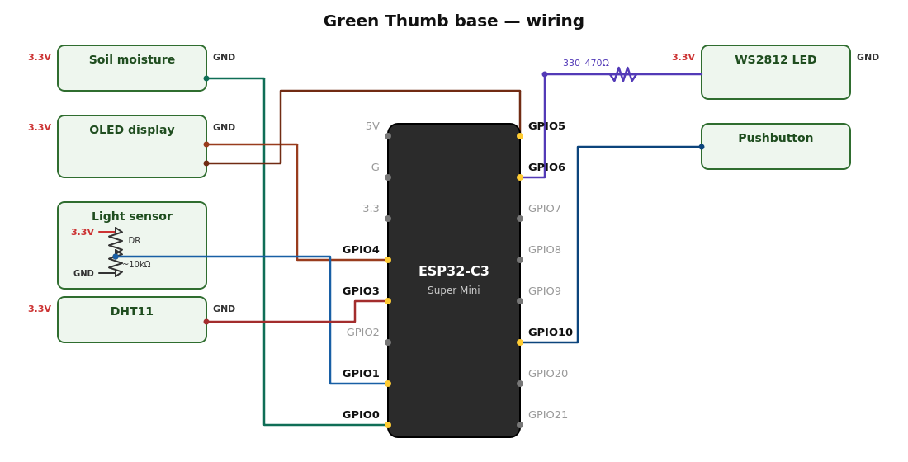

# Building & Setting Up Green Thumb

**Status check first:** `main.py` now wires every driver and core module into a running device - this is a real, testable end-to-end firmware, not just individual pieces anymore. What's still genuinely not ready: the enclosure doesn't exist and no BLE modules exist to pair with. The GPIO pin map is confirmed against an ACEIRMC Super Mini board photo (see below), but if you're using a different clone vendor's board, double-check its silkscreen first. This page documents what's ready now and flags clearly what isn't.

## Hardware

See [`README.md`](../README.md#hardware-base-station) for the current parts list, and `pins.py` for the exact GPIO assignments.



**Before wiring anything:**
- **GPIO pin map (`pins.py`) is confirmed against an ACEIRMC ESP32-C3 Super Mini board photo** - every pin used is physically present on that board's silkscreen (see `docs/ARCHITECTURE.md`). If you're using a different "Super Mini" clone vendor, double-check against your specific board's silkscreen first, since labeling has been reported to vary slightly across them. GPIO4-6 (I2C, WS2812) are used despite some sources describing them as JTAG-reserved; accepted since this project doesn't use hardware JTAG debugging, but worth knowing if you plan to.
- **Two resistors needed:** the light sensor's LDR needs a fixed resistor (~10kΩ starting point) to form a voltage divider - without it the ADC pin can't read a variable light level at all, not just a tuning nicety. The WS2812 wants a 330-470Ω series resistor on its data line for signal protection (not brightness - that's set in software).
- **Enclosure** (the 3D-printed fist/thumbs-up housing) - not designed in this repo. No print files exist yet.
- **BLE modules** (watering pump, etc.) - none exist yet. Pairing isn't testable until at least one does.

## Software prerequisites

- **MicroPython firmware** flashed onto the ESP32-C3, matching whatever version you intend to also match with `mpy-cross` (see below) - get this from [micropython.org](https://micropython.org/download/) for the ESP32-C3.
- **Vendored libraries**, not included in this repo (see `docs/ARCHITECTURE.md`'s repo layout) - install into `/lib` on the device:
  - `ssd1306` (display driver) - via `mip.install("ssd1306")` from the MicroPython REPL, or copy from [micropython-lib](https://github.com/micropython/micropython-lib).
  - `umqtt.simple` (MQTT client - **not** `umqtt.robust`, see `docs/ARCHITECTURE.md` for why) - same source.
  - `aioble` (async BLE) - same source.

- **mpy-cross** (optional but recommended - see `tools/build_mpy.sh`), matching your exact flashed MicroPython version. Mismatched versions produce `.mpy` files that silently fail to load.

## Precompiling (optional, recommended)

```
./tools/build_mpy.sh
```

Produces a `build/` directory mirroring the source tree, with `core/`, `drivers/`, `web/server.py`, `pins.py`, and `version.py` compiled to `.mpy` bytecode. `boot.py`/`main.py` are copied unchanged as plain `.py` (tiny bootstrap entry points, easier to debug/patch live via the REPL without recompiling), and `web/static/*` (not Python) is copied unchanged too. Requires `mpy-cross` on your `PATH`; the script fails with a clear error if it's missing rather than silently skipping compilation.

## Copying files to the device

Use [`mpremote`](https://docs.micropython.org/en/latest/reference/mpremote.html), `ampy`, `rshell`, or Thonny's file manager to copy either the raw repo source or the `build/` output onto the device's flash, preserving the directory structure (`/core`, `/drivers`, `/web`, `/lib`).

## Initial setup

**Wired together in `main.py` and verified with a mocked-hardware smoke test (see `docs/ARCHITECTURE.md`) - not yet verified on real physical hardware.** The flow below is what the code actually does, not just a documented intent.

1. On first boot (no WiFi credentials saved yet), the device starts an open access point named `GreenThumb-Setup-<ID>` - the OLED display shows this SSID and the address to visit directly, so you don't need to look either up.
2. Connect to that network from a phone/laptop, and a captive-portal-style setup page should load (or navigate to `http://192.168.4.1/` manually).
3. Enter your home WiFi network name and password. The device saves them and attempts to connect immediately, showing success/failure without needing a reboot.
4. Once connected, the device's dashboard is reachable at its new IP address on your home network (check your router's client list, or the setup page's success message if it's still open).

## Configuration values you'll need to set

| Value | Where it's set today | Notes |
|---|---|---|
| WiFi SSID/password | Setup portal (AP mode) | Working - see above |
| Device name | Dashboard (pencil icon next to the title) | Working |
| MQTT broker address/port/username/password | **Settings page** (`/settings`) | Working - saving triggers a live reconnect attempt and reports success/failure immediately |
| Health thresholds (temp/humidity/soil/light green-yellow-red ranges) | **Settings page** (`/settings`), or Home Assistant (`set_config` MQTT command) once HA integration exists | Working via settings page. Defaults are sourced generic-houseplant values - see `docs/ARCHITECTURE.md`. `light_fc`'s red thresholds are unset (no sourced data yet) and will stay inert until you set them - the settings page shows them as blank/optional. |
| Light tracking, timing, display/night-mode, status LED, timezone settings | **Settings page** (`/settings`) | Working |
| Sensor failure alert thresholds (1h/6h defaults) and multi-alert behavior (combined vs. layered) | **Settings page** (`/settings` → advanced for the multi-alert mode toggle) | Working. The 1h threshold surfaces in the dashboard/health topic only; the 6h threshold also lights the physical alert LED (a slow flash between the current health color and red - never overrides night-mode DND). Currently tracks DHT11 unconditionally, and soil moisture/light only once each is calibrated - see `docs/ARCHITECTURE.md`. |
| Status LED idle display (solid/breathe/pulse-once/off) and colorblind-safe or custom color schemes | **Settings page** (`/settings` → advanced for the color scheme section) | Working. Idle mode and breathe speed are one setting; color scheme is set independently for the web portal and the alert LED, with an optional sync toggle. Colorblind mode swaps green→blue and red→orange; custom mode lets you pick any three colors. |
| Temperature display unit (°F/°C) | **Settings page** (`/settings`, Display & Night Mode section) | Working. Display-only — converts the OLED and dashboard's live reading; thresholds always stay in °F regardless of this setting, see `docs/ARCHITECTURE.md`. |
| Direct light target (min/max hours of direct sun per day) | **Settings page** (`/settings` → advanced) | Working, but only takes effect once `light_fc`'s red-max threshold is also set (defines what counts as "direct/high-intensity" light) - see `docs/ARCHITECTURE.md`. Optional/non-essential - never affects overall plant health status. |
| Light sensor mode: single continuous reading vs. named reference points ("Direct Sun," "Bright Shade," etc.) | **Settings page** (`/settings` → advanced) | Working - "Sample Now" takes a live reading while you hold the sensor in that condition, rather than typing in a raw number. Dashboard shows a "Light Level" badge with whichever point the current reading is closest to, once at least one point is added. |
| Soil moisture calibration (dry/wet reference points) | **Calibration page** (`/calibration`) | Working - guided flow (start → read dry → read wet → save), each read step takes ~2s (averaged samples). Also reachable via MQTT (`calibration/command`) - both go through the same state machine. |
| Light sensor calibration (dark/bright reference + known fc value) | **Calibration page** (`/calibration`) | Working - same guided flow as soil, plus a field for the known foot-candle value at save time. You'll need an external lux reference (a light meter or phone app) to supply that value - there's no way around that requirement, see `docs/ARCHITECTURE.md`. |
| BLE module pairing | **Pairing page** (`/pairing`), button (long-press), or MQTT | Wired and functional - start a 60s scan from any of the three, pick a candidate, done. Not meaningfully testable yet since no BLE modules exist to pair with (see below). |
| Module calibration (whatever a given module reports needing) | **Calibration page** (`/calibration`) | Wired and functional as a generic passthrough - the base has no built-in knowledge of any module type's calibration needs, it just relays values back to the module (see `docs/ARCHITECTURE.md`'s provisional module calibration contract). Not meaningfully testable yet, same reason as pairing above - no real module firmware exists to define what it actually needs calibrated. |

## What's not yet possible

- Pairing a BLE module for real (the mechanism is wired and works, but no BLE modules exist yet to pair with).
- Verifying any of the above on real physical hardware - everything so far is verified via software mocks in a development sandbox, not a flashed device.
- HACS integration - an early scaffold exists in a [separate repo](https://github.com/HackThePlanetKC/The-Green-Thumb-HACS-Integration), but it's untested against a real Home Assistant instance and doesn't yet handle modules (none exist to test against).
